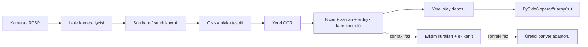

# IPScans LPR Pro — Faz 1 mimari ve mevcut sistem incelemesi

Tarih: 10 Ekim 2026. Durum: geliştirme önizlemesi; üretim ürünü değildir.

## 0.2.0 uygulama güncellemesi

Aşağıdaki ilk mimari kararlarına ek olarak FastPlateOCR 1.1.0 adaptörü seçeneği geliştirildi ve ONNX Runtime 1.31.0 ile gerçek inference doğrulandı. YOLOv9 384 girişli Nx7 (`batch,x1,y1,x2,y2,class,score`) ve CCT XS v2 OCR kullanıldı. OCR RGB dönüşümü ve en düşük gerçek karakter skoru kullanılıyor; Paddle alternatifi henüz doğrulanmadı.

`lpr.desktop` Qt arayüzü `QProcess` ile ayrı CLI inference süreci başlatır; stop/timeout alt süreci sonlandırır. Bu işçi düzeni offline laboratuvar içindir; RTSP servis supervisor'ının yerine geçmez. `lpr.video` yerel dosyaları sıralı okur ve EOF'ta durur. Değerlendirme izni yalnız offline komutlarda kabul edilir; canlı mod ticari model onayı ister. Hiçbir modda bariyer sürücüsü yoktur.

Model ve config dosyaları hash ile doğrulanır. Kod kütüphanelerinin MIT lisansları, eğitim verisinin ticari hak incelemesini tek başına tamamlamaz. Bu nedenle değerlendirme manifestinde ticari onay verilmedi. Ayrıntılar `PHASE2_0.2.md` dosyasındadır. Aşağıdaki "UI henüz yok" gibi ilk kesit açıklamaları 0.1.0 başlangıç durumunu kaydeder; 0.2.0 test konsolu tam Faz 5 ürünü değildir.

## Doğrulanan mevcut kod tabanı

9 Ekim tarihli **IPScans+ uygulamasını v3.0’a yükselt** sohbeti üzerinden son çalışma kopyası bulundu:
`C:\Users\pc\Documents\Codex\2026-10-09\ipscans-uygulamas-n-d-nyan-n\work\ipscans-depo`.
İnceleme anındaki HEAD: `a6b9e83` — `Validate eight localized scanner features`.

- `desktop-app/README.md` ve `V43_RELEASE.md`: IPScans+ 4.3.0, PyQt6, ağ keşfi, SCAN/NETWORK MAP, yerel cihaz isimleri, PDF raporları. Kamera görüntüsü/LPR motoru değildir.
- `desktop-app/app/core/models.py`, `topology.py`, `protocols/` mevcut cihaz ve bağlantı kanıtı yaklaşımının entegrasyon adaylarıdır. Cihazın IP adresi kimlik kanıtı değildir. Eski yönetim kodu otomatik olarak LPR’ye taşınmayacak.
- `desktop-app-pro/`: ayrı Network Health Pro ürünü; sibling scanner kodunu import eden mimari. LPR bu runtime import bağımlılığını devralmayacak.
- `package.json`: Next.js 16.3.8, React 19.2.8, TypeScript, Tailwind; testler `tools/*.test.mjs` ve `tools/*.test.cjs`.
- Windows build akışları ve eski Pro akışı incelendi: PyInstaller, paket selftest, public/downloads'a binary yayınlama. Son scanner belgeleri ayrıca installer yükseltme, checksum ve provenance testleri tanımlıyor. Bu rapor mevcut CI sonuçlarının yeniden doğrulandığı anlamına gelmez.
- İncelemede 3 Ekim kaynak kopyası da bulundu; güncel mimari referansı 9 Ekim kopyasıdır.

Mevcut depo değiştirilmedi. Yeni kaynak paketi bu sohbetin `outputs/ipscans-lpr-pro` klasöründedir. Sonraki entegrasyon için depoda `desktop-app-lpr/` bağımsız ürün dizini önerilir. Web sitesi ve indirme akışına bu aşamada değişiklik yapılmadı.

## Bileşenler ve veri akışı

Mevcut çalışan kesit: CLI → kamera işçisi / görüntü → değiştirilebilir detector/OCR → consensus → SQLite. UI, erişim kararı ve gerçek röle adaptörü henüz yok. `recognized` yalnızca plakanın okunduğunu ifade eder; `allowed` veya geçiş emri değildir.

### Sınırlar ve varsayımlar

1. İlk sürüm tek istasyon, tek kamera, tek şerit ve karede en fazla bir plaka varsayar. Birden fazla tespitte consensus sıfırlanır; takip kimliği ataması henüz yok.
2. Engine Qt import etmez. Kamera thread'i ve tek elemanlı kuyruk eski kare birikimini önler. FFmpeg open/read timeout 3 saniye; bozuk native sürücünün timeout'u yok saymasına karşı proses supervisor sonraki fazdır. Daemon thread watchdog garantisi değildir.
3. Yerel OpenCV, ONNX Runtime ve PaddleOCR adaptörleri isteğe bağlıdır. ONNX sözleşmesi float32 RGB NCHW, letterbox 640, çıktı `[N,6]` veya `[1,N,6]`: `x1,y1,x2,y2,score,class`. Koordinatlar letterbox piksel uzayında, plaka sınıfı 0. Ham YOLO tensörleri otomatik yorumlanmaz; modele özel export/decoder doğrulanmalıdır.
4. PaddleOCR 3 `TextRecognition` yerel `model_dir` üzerinden çağrılır. Yerel dosyalar manifestte hash ile kaydedilir. Otomatik model indirme akışı yoktur; kullanılan Paddle sürümünün çevrimdışı davranışı ayrıca test edilmelidir.
5. Ortalama OCR güveni kalibre olasılık değildir. Gündüz/gece için eşik seçimi gerçek doğrulama kümesiyle yapılacaktır. Örnek `.90`, 3 kare, 2 saniye pencere, 10 saniye bastırma yalnızca başlangıç değerleridir.
6. Türkiye doğrulayıcısı sıradan sivil plakaların muhafazakâr alt kümesini kapsar. Özel/diplomatik/yabancı plakalar incelemeye gider. Harf-rakam otomatik değiştirme yapılmaz. Resmî tescil doğrulaması değildir.
7. Kare sırası ve tazelik kontrolü yazılım içi tekrarları azaltır. Kamera tarafından yeniden oynatılan video veya kopyalanmış plaka fiziksel kimlik kanıtı olmadan tespit edilemez. Gerçek bariyer için loop/radar gibi bağımsız varlık kanıtı, yön/geçiş çizgisi ve cihaz komut kimliği gerekir.
8. Kaynak URL ortam değişkeninden alınır; CLI çıktısına yazılmaz. Ortam değişkeni kalıcı şifre kasası değildir. Windows Credential Manager/DPAPI, erişim rolleri ve TLS üretim önkoşuludur.
9. SQLite varsayılan olarak bellektedir. Dosya istenirse yalnızca geliştirme verisi için kullanılır. RBAC, şifreli disk/veritabanı, güvenli medya deposu, denetim zinciri ve yedek politikası henüz yoktur. `purge` mantıksal silmedir; WAL/yedeklerden fiziksel imha garantisi değildir.
10. Plaka kırpıntısı/araç görüntüsü henüz kalıcı kaydedilmez. Veri minimizasyonu varsayılandır. Görüntü saklama ayrı izin ve saklama politikasına bağlı olacak.

## Teknoloji kararları

| Alan | Başlangıç kararı | Gerekçe / sınır |
|---|---|---|
| Python | üretim adayı 3.11/3.12 x64 | Mevcut scanner CI 3.11 yaklaşımı; bu makinede yalnız 3.14 ile çekirdek test edildi. OCR wheel uyumluluğu ayrıca doğrulanmalı. |
| Arayüz | PySide6, ayrı süreç | PyQt6 tabanlı eski ürünle kod kopyalamadan aynı görsel dil; Qt lisans incelemesi gerekli. Faz 5. |
| Inference | ONNX Runtime CPU, seçilebilir CUDA | CPU varsayılan; GPU açıkça istenir ve yoksa sessiz performans vaadi yerine hata. |
| OCR | PaddleOCR 3 adaptörü | Türkçe plaka benchmark'ıyla son seçim; kod lisansı ile model lisansı ayrı kontrol. |
| Yerel veri | SQLite WAL | Tek yazıcı; çok istasyon için PostgreSQL ve migration/repository katmanı Faz 3. |
| Servis API | FastAPI + WebSocket önerisi | Faz 3/6; auth olmadan dışa açık sunucu başlatılmaz. |
| Paketleme | PyInstaller onedir, imzalı installer | OCR/model dosyaları ayrı yönetilir; yükseltme/geri alma ve hash doğrulama Faz 7. |

## Ticari paket ve bariyer tasarımı — henüz uygulanmadı

Starter: 2 kamera, yerel kayıt. Professional: 8 kamera, bariyer, rapor, çoklu kullanıcı. Enterprise: imzalı hak setindeki kapasite, çoklu tesis ve merkezi API. Bunlar lisans sınırlarıdır; donanım performans garantisi değildir.

Çevrimdışı lisans için üretici özel anahtarıyla imzalı sürümlü hak belgesi, istemcide yalnız açık anahtar, makine/tesis bağı ve süre; saat geri alma ve iptal politikası açıkça tanımlanacak. Sunucu kesintisinde imzalı hakların geçerlilik süresi esas alınacak; süresiz gizli grace dönemi olmayacak. Lisans bitmesi yalnız yazılımın yeni otomatik yetkilendirme taleplerini sınırlar; fiziksel acil çıkış, sensör veya üretici emniyet mekanizmasını hiçbir koşulda kontrol etmez.

Erişim kuralları: kara liste önceliği, aktif izin, saat aralığı, yön, güven, fiziksel varlık ve idempotent olay kimliği birlikte değerlendirilir. Tek kullanımlı izin atomik rezervasyon + donanım sonucu ile işlenir. Komut timeout'unda kör tekrar yok; sonuç `unknown` kalır ve operatör incelemesi gerekir. DB kaybı/yetki belirsizliğinde otomatik açma isteği üretilmez. Manuel müdahale ayrı rol ve gerekçe ister.

## Güvenlik ve veri koruma uygulama işleri

KVKK uyumlu ürün sertifikası veya hukuki görüş sunulmamaktadır. Üretime geçişte müşteri veri sorumlusuyla hukuki dayanak, aydınlatma, erişim matrisi, saklama süreleri, ilgili kişi başvuruları, dışa aktarma ve ihlal prosedürleri netleştirilecek. Yazılım teslimi bu operasyonel kararların yerine geçmez.

Güvenlik geliştirmeleri: Argon2id parola hash'i, Windows secret store, varsayılan localhost/yerel IPC, uzak bağlantıda TLS ve yetkilendirme, salt okunur operatör rolleri, gerekçeli düzeltme geçmişi, izinli export, ayrı servis hesabı, medya kotası, log redaksiyonu, imzalı güncelleme ve geri alma. Üretim öncesi tehdit modeli, bağımlılık SBOM'u ve penetrasyon testi gerekiyor.
